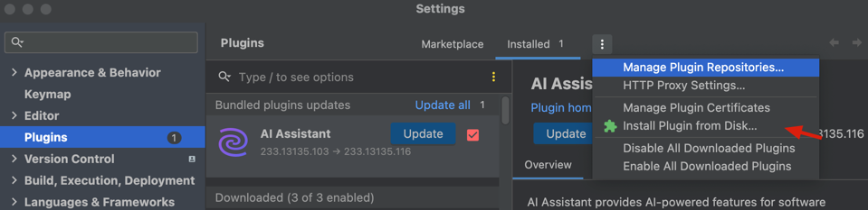

# Graph Database plugin for IntelliJ Platform And Tabby

This plugin is based on [graphdb-intellij-plugin](https://github.com/albertoventurini/graphdb-intellij-plugin), see his [README](README_OLD.md) for more details.

And the idea from [BytecodeDL](https://github.com/BytecodeDL/graphdb-intellij-plugin)
## Installation

1. Download latest release.
2. Go to `Preferences` -> `Plugins` -> `Install Plugin from Disk`
3. Install plugin and restart the IDE.

## Workflow for Tabby

1. Use tabby.jar to generate the CPG.
2. Use tabby-vul-finder.jar to load the CPG on Neo4j.
3. Use tabby-intellij-plugin to find vulnerabilities easily.

